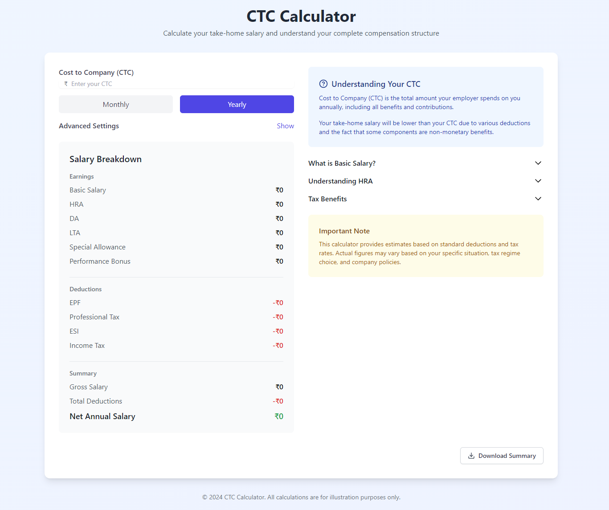

# CTC Calculator

An interactive Cost to Company (CTC) calculator to help employees understand their salary structure and take-home pay.

## 🚀 Features

- **Interactive CTC Calculation**: Easily calculate take-home salary based on CTC
- **Flexible Input Options**: 
  - Monthly/Yearly calculation toggle
  - Percentage/Fixed amount inputs for special allowance and performance bonus
- **Tax Regime Support**: Choose between Old and New tax regimes
- **HRA Exemption Calculator**: Metro/Non-metro city selection with rent input
- **Detailed Salary Breakdown**: Clear visualization of earnings and deductions
- **Customizable Components**: Adjust percentages for basic salary, HRA, and more
- **Export Functionality**: Download detailed salary breakdown as a text file

## 🛠️ Tech Stack

- React 18
- TypeScript
- Tailwind CSS
- Lucide React (icons)
- Vite (build tool)

## 🏁 Getting Started

### Prerequisites

- Node.js (v14 or later)
- npm

### Installation

1. Clone the repository
   
   git clone https://github.com/ksanjeev284/CTCcalculator.git
   
2. Navigate to the project directory
   
    cd ctc-calculator
   
3. Install dependencies
   npm install

4. Start the development server
   npm run dev

## 🖥️ Usage

1. Enter your CTC (Cost to Company)
2. Select calculation frequency (Monthly/Yearly)
3. (Optional) Customize salary components in "Advanced Settings"
4. Choose your tax regime (Old/New)
5. Input rent details for HRA exemption calculation
6. View the detailed salary breakdown
7. Download the summary if needed

## 🤝 Contributing

Contributions are welcome! Please feel free to submit a Pull Request.

1. Fork the repository
2. Create your feature branch (`git checkout -b feature/AmazingFeature`)
3. Commit your changes (`git commit -m 'Add some AmazingFeature'`)
4. Push to the branch (`git push origin feature/AmazingFeature`)
5. Open a Pull Request

## 📄 License

This project is licensed under the MIT License - see the [LICENSE](LICENSE) file for details.

## ⚠️ Disclaimer

This calculator is for illustration purposes only. Actual salary calculations may vary based on company policies, location, and current tax laws. Please consult with a financial advisor for accurate calculations.

## 🙏 Acknowledgments

- Built with [React](https://reactjs.org/)
- Styled with [Tailwind CSS](https://tailwindcss.com/)
- Icons by [Lucide React](https://lucide.dev/)
- Powered by [Vite](https://vitejs.dev/)

## CTC Calculator FlowChart

   

